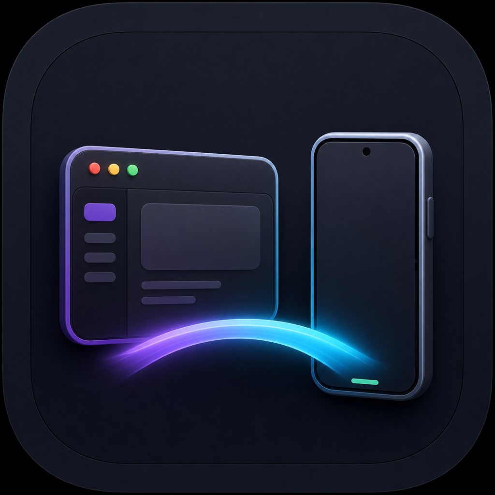
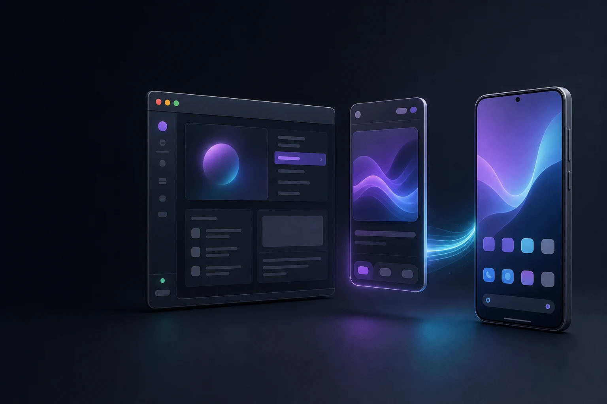
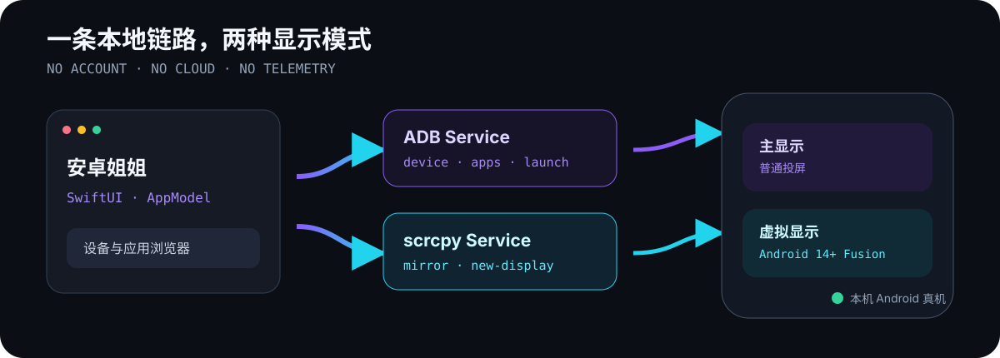

<p align="center">
  
</p>

<h1 align="center">安卓姐姐 · Android Sister</h1>

<p align="center">
  <strong>让 Android 真机上的应用，在 Mac 上独立打开。</strong><br>
  本地优先、原生 SwiftUI、基于 ADB 与 scrcpy，不需要模拟器、账号或云服务。
</p>

<p align="center">
  <a href="https://github.com/LUCIENIN/android-sister/actions/workflows/ci.yml"></a>
  <a href="https://github.com/LUCIENIN/android-sister/releases"></a>
  
  
  <a href="./LICENSE"></a>
</p>

<p align="center">
  
</p>

> [!IMPORTANT]
> 当前是 `v0.1.0-alpha.1` 开发预览版。已在一台 HONOR Android 14 真机上完成核心链路验证，但安装包仅为 ad-hoc 签名，尚未 Developer ID 签名或 Apple 公证。

## 现在能做什么

- **识别真机**：发现 USB / Wi-Fi ADB 设备，区分已连接、未授权、离线和权限异常。
- **浏览应用**：读取设备、Android 版本、厂商、机型和可启动应用，支持包名搜索。
- **普通投屏**：在手机主显示器启动目标应用，并用 scrcpy 打开控制窗口。
- **Fusion 窗口**：在 Android 14+ 创建临时虚拟显示，让目标应用与手机主屏独立运行。
- **完全本地**：不安装常驻手机 App，不连接项目服务器，不收集统计或设备内容。

## 真机验证，不只看编译

以下证据记录于 2026-07-30；测试素材包含手机内容，验收后已删除，没有提交到仓库。

| 验证项 | 结果 |
| --- | --- |
| 目标设备 | HONOR · Android 14 / SDK 34 |
| 应用发现 | 92 条桌面入口、43 个第三方包 |
| 普通投屏 | 有效 H.264 画面，1080 × 2384 |
| Fusion | 创建虚拟显示 `id=10`，退出后完成清理 |
| 工程质量 | 8/8 单元测试、Release 构建、Info.plist 校验、ad-hoc 签名验证通过 |

这份验证只证明上述设备和环境，不等于 Pixel、Samsung、Xiaomi 或其他 Android 版本已经兼容。完整记录见 [验证说明](./docs/verification.md)。

## 3 分钟开始

### 1. 准备工具

```bash
brew install android-platform-tools scrcpy
```

手机打开“开发者选项 → USB 调试”，连接 Mac，并在手机上确认这台电脑的调试授权。

### 2. 从源码运行

```bash
git clone https://github.com/LUCIENIN/android-sister.git
cd android-sister
swift test
./scripts/package-app.sh release
open dist/AndroidSister.app
```

也可以从 [Releases](https://github.com/LUCIENIN/android-sister/releases) 下载 Apple Silicon 预览包。它尚未公证；如果你需要可信的日常分发版本，请等待 Developer ID 版本，而不是绕过 macOS 安全检查。

### 3. 打开应用

在左侧选择设备，在右侧应用列表点击：

- **投屏**：目标应用在手机主屏启动；
- **融合**：Android 14+ 在独立虚拟显示中启动。

如果自动发现失败，可在“设置 → 工具”填写 `adb` 和 `scrcpy` 的绝对路径。

## 它如何工作

<p align="center">
  
</p>

所有命令都以参数数组直接启动，不经过 shell。ADB 输出通过临时文件读取，避免大量应用列表堵塞进程管道；Fusion 退出时由 scrcpy 回收临时显示。

## 明确的边界

当前版本**没有**剪贴板同步、通知转发、文件拖放、Finder File Provider、APK 检查、MCP 控机、自动更新或云同步。界面窗口由 scrcpy 承载，也不是对其他同类产品的完整替代。

下一步优先级是：本地剪贴板 / 通知 / 拖放与安全 MCP → Finder 文件扩展 → 多品牌兼容与正式签名。详见 [ROADMAP](./ROADMAP.md)。

## 开发与参与

- 开发环境：macOS 15+、Swift 6.1+、ADB、scrcpy 4.x
- 最小验证：`swift test`
- Release 构建：`swift build -c release`
- App 打包：`./scripts/package-app.sh release`

欢迎提交 Issue 和 Pull Request。开始前请阅读 [贡献指南](./CONTRIBUTING.md)；安全问题请按 [安全政策](./SECURITY.md) 私下报告。

## 独立项目与许可证

安卓姐姐是独立实现，不复制 AndroMeld 或其他产品的名称、图标、素材与未公开代码。ADB、Android、Apple 和 scrcpy 的名称与商标归各自权利人所有；外部依赖说明见 [THIRD_PARTY_NOTICES](./THIRD_PARTY_NOTICES.md)。

项目代码与原创视觉资产采用 [MIT License](./LICENSE)。
